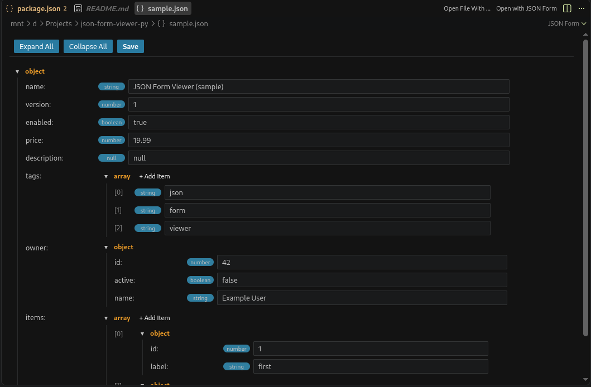

# JSON Form Viewer

Render `.json` files as an editable, form-based GUI inside a VS Code WebView
custom editor - similar to Altova Authentic, but for JSON.

- Objects render as labeled fields.
- Nested objects and arrays render as collapsible sections.
- Arrays render as repeatable items with an **Add Item** button and per-item
  remove buttons.
- Primitive values (`string`, `number`, `boolean`, `null`) render as editable
  inputs with a live type badge.
- User input is auto-detected and coerced: `true` -> boolean, `123` -> number,
  `null` -> null, anything else -> string.
- Toolbar with **Expand All**, **Collapse All**, and **Save** (writes back to
  disk).
- Light and dark theme support via VS Code theme variables.
- No external frameworks - only native VS Code APIs and plain HTML/JS/CSS.

## Requirements

- VS Code 1.85.0 or newer.
- Node.js 18+ and npm (for building/packaging).

## Example:


## Project structure

```
json-form-viewer/
├── package.json          # Extension manifest (custom editor contribution)
├── tsconfig.json         # TypeScript configuration
├── .vscodeignore         # Files excluded from the packaged .vsix
├── src/
│   ├── extension.ts      # Entry point: registers the editor, command, status bar
│   └── formRenderer.ts   # CustomTextEditorProvider (WebView host)
└── media/
    ├── main.js           # WebView frontend logic (render/serialize the form)
    └── style.css         # WebView styling (theme-aware)
```

## Build

```bash
npm install
npm run compile
```

This compiles `src/` into `out/` using `tsc`.

## Run / debug

1. Open this folder in VS Code.
2. Press `F5` to launch an Extension Development Host.
3. Open any `.json` file - it opens in the JSON Form editor automatically.
4. You can also right-click a `.json` file in the Explorer and choose
   **Open with JSON Form**, use the editor title menu, or click the
   **JSON Form** status bar item.

## Package

Install `vsce` (if not already available) and build the `.vsix`:

```bash
npm install -g @vscode/vsce
npm run package
# or directly:
npx @vscode/vsce package
```

This produces `json-form-viewer-1.0.0.vsix`.

## Install the packaged extension

```bash
code --install-extension json-form-viewer-1.0.0.vsix
```

## Configuration notes

- The custom editor is registered with `"priority": "default"`, so `.json`
  files open in the form editor by default. To make it opt-in instead, change
  `"priority"` to `"option"` in `package.json` (users then open it via
  "Open With..." or the provided command).
- Only valid JSON can be saved. If the document is invalid (or empty), the
  editor shows an inline message and the Save action is disabled.

## License

MIT
