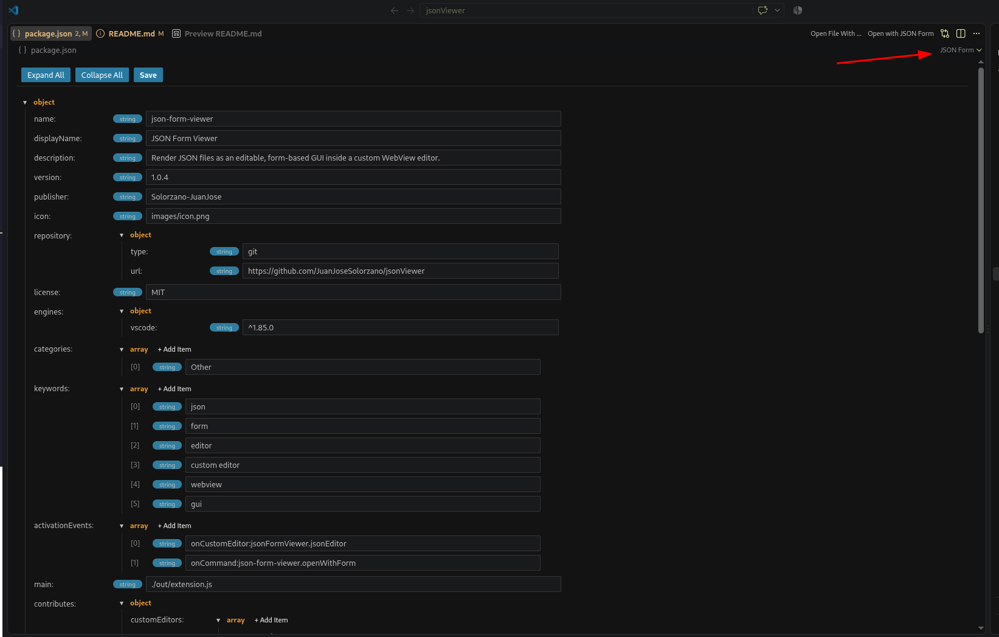

# JSON Form Viewer

Render `.json` files as an editable, form-based GUI inside a VS Code WebView
custom editor - similar to Altova Authentic, but for JSON.

- Objects render as labeled fields.
- Nested objects and arrays render as collapsible sections.
- Arrays render as repeatable items with an **Add Item** button and per-item
  remove buttons.
- Primitive values (`string`, `number`, `boolean`, `null`) render as editable
  inputs with a live type badge.
- User input is auto-detected and coerced: `true` -> boolean, `123` -> number,
  `null` -> null, anything else -> string.
- Toolbar with **Expand All**, **Collapse All**, and **Save** (writes back to
  disk).
- Light and dark theme support via VS Code theme variables.
- No external frameworks - only native VS Code APIs and plain HTML/JS/CSS.

## Requirements

- VS Code 1.85.0 or newer.

## Example:

---

1. Open any .json file in VS Code.
2. If you have the extension installed, it opens in the JSON Form editor automatically.
3. You can also right-click a `.json` file in the Explorer and choose.
   **Open with JSON Form**, use the editor title menu, or click the
   **JSON Form** status bar item.

## Installation
- Vscode Marketplace: [https://marketplace.visualstudio.com/items?itemName=Solorzano-JuanJose.json-form-viewer](https://marketplace.visualstudio.com/items?itemName=Solorzano-JuanJose.json-form-viewer)

- Install from VSIX: Download the latest release from the GitHub repository `json-form-viewer.vsix` 

## Configuration notes

- The custom editor is registered with `"priority": "default"`, so `.json`
  files open in the form editor by default. To make it opt-in instead, change
  `"priority"` to `"option"` in `package.json` (users then open it via
  "Open With..." or the provided command).
- Only valid JSON can be saved. If the document is invalid (or empty), the
  editor shows an inline message and the Save action is disabled.

## License

MIT
